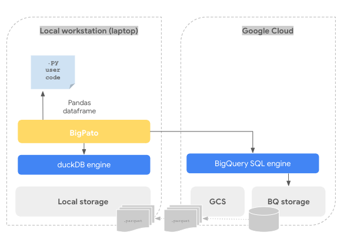
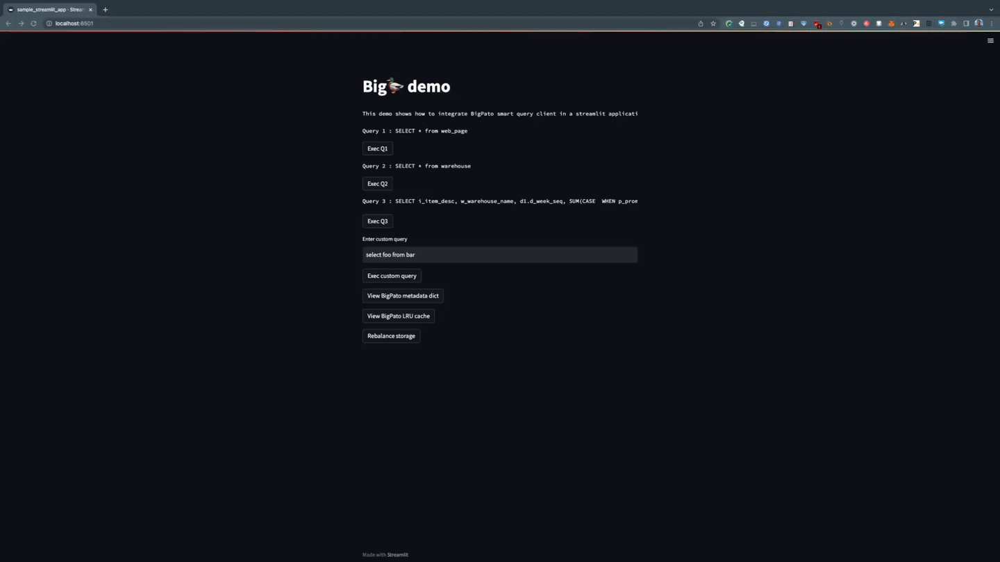

# BigPato: a smart SQL client for BigQuery and duckDB


BigPato is a experimental python package that implements a smart SQL router between two SQL backend engines: `BigQuery` and `duckDB`.

The overal idea is maintaning a hybrid database, where the most used tables will be located at our local computer (e.g. laptop) and the rest in a cloud DWH like `BigQuery`.




`BigPato` implements:
- A simple automatic data tiering mechanism that updates local storage on request.
- A SQL transpilation between `BigQuery` and `duckDB` SQL engines, so same query works on both engines.
- A unified interface that redirects queries to the most performant engine and return a `pandas` dataframe with they query ouptput

## Demo

A demo showcasing the integration of BigPato with streamlit is included under the `sample/` folder



## Example run

Import the package and create a new `BigPato` client calling `BigPato`:

```python
from bigpato import bigpato

bq_project = 'GCP_PROJECT'
bq_database = 'BQ_DATASET_NAME'
bq_key = 'JSON_FILE'
duckdb_db = 'DUCKDB_FILE'
local_duck_folder = 'LOCAL_DATA_FOLDER'
export_bq_bucket = 'GCS_BUCKET'

bp_client = bigpato.BigPato(bq_project=bq_project, bq_database=bq_database, bq_key=bq_key,
                                     duckdb_db=duckdb_db, local_duck_folder=local_duck_folder, export_bq_bucket=export_bq_bucket)
```

The constructor takes the following arguments:

* `bq_project` = Google Cloud Platform project 
* `bq_database` = BigQuery dataset to use, it should be already created. BigPato only supports querying tables under the same dataset
* `bq_key` = Service Account secrets JSON key with enough permissions to execute SQL queries and export data to GCS
* `duckdb_db` = Local duckDB metadata file, if it is not present it will be created on the first run
* `local_duck_folder` = A local folder where the duckDB will cache tables 
* `export_bq_bucket` = A GCS bucket that will be used to export BigQuery tables in parquet format.

Inspect the table location metadata calling `get_metadata_dict()`:

```python
print(bigpato_client.get_metadata_dict())

```
`BigPato` maintains a interal catalog with information about the tables deployed in the specified BigQuery dataset and the tables promoted to local storage (also registered on the `duckDB` catalog). That will return the tables location:

```python
{'call_center': {'location': 'local', 'usage': 0},
...
'catalog_page': {'location': 'bigquery', 'usage': 0},
'web_returns': {'location': 'bigquery', 'usage': 0}
}
```

In the example above we have a dataset at BigQuery with the TPC-DS tables, but some tables have been already promoted to local in previous executions.
In this case, the table `call_center` is a local table accesible by `duckDB` and the tables `catalog_page` and `web_returns` are tables in `BigQuery`.

Run a query against a `BigQuery` located table , the `exec_query` method get a SQL query and returns a `pandas` dataframe

```python
  df = bigpato_client.exec_query("SELECT * FROM catalog_page")
```
Note that there is no need for using the `BigQuery` `<DATASET>.<TABLE_NAME>` syntax


Now, run a query against a `duckDB` located table , the `exec_query` method get a SQL query and returns a `pandas` dataframe

```python
  df = bigpato_client.exec_query("SELECT * FROM call_center")
```
Note that there is no need for using the `duckDB` SQL dialect, `BigPato` transpiles between `BigQuery` and `duckDB` SQL dialects


Inspect the LRU candidate cache, this keeps track of the most recently used tables:

```python
print(bigpato_client.get_cache())

```

This will show the top `LRU_TABLE_CAPACITY` (by default setup at 10) most used tables by previous queries, in this case it will show the previous queried tables `catalog_page` and `call_centers`. Once the cache limit is reached , old tables will be evicted

```python
OrderedDict([('catalog_page', 'catalog_page'), ('call_center', 'call_center')])
```
Now, you can run a rebalance operation to promote candidate tables to local storage, in this case only the `catalog_page` will be promoted (`call_center` is already local)

```python
bigpato_client.launch_balance_storage()
```

Logs will show:

```bash

022-11-25 16:10:58.262 Table catalog_page extracted
Copying gs://bigpato-export-bucket/catalog_page/catalog_page000000000000...
- [1/1 files][  2.2 MiB/  2.2 MiB] 100% Done                                    
Operation completed over 1 objects/2.2 MiB.                                      
2022-11-25 16:11:00.408 Table catalog_page downloaded
2022-11-25 16:11:00.408 Populating metadata from duckDB ..
2022-11-25 16:11:01.856 Removing orphaned files...
```

Inspect the table location metadata once again:

```python
print(bigpato_client.get_metadata_dict())

```
That will show the updated localtion of the `catalog_page` table:

```python
{ 'catalog_page': {'location': 'local', 'usage': 0} }
```
Re-run the initial query again, it will be executed locally:

```python
  df = bigpato_client.exec_query("SELECT * FROM catalog_page")
```
Logs will show:
```bash
2022-11-25 16:21:29.122 Executing query SELECT * FROM catalog_page with duckDB ..
```


## Install
From PyPI:

```bash
pip install bigpato
```

From source:

```bash
source launch_build_install_package_source.sh
```


